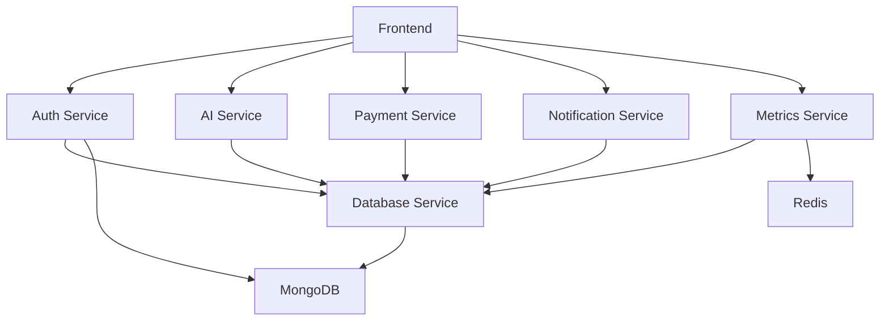

# NydArt Advisor - Complete Technical Documentation

## Table of Contents
1. [Project Overview](#project-overview)
2. [System Architecture](#system-architecture)
3. [Technology Stack](#technology-stack)
4. [Service Architecture](#service-architecture)
5. [Installation & Setup](#installation--setup)
6. [Configuration](#configuration)
7. [API Reference](#api-reference)
8. [Deployment Guide](#deployment-guide)
9. [User Manual](#user-manual)
10. [Update Manual](#update-manual)
11. [Monitoring & Troubleshooting](#monitoring--troubleshooting)
12. [Security Considerations](#security-considerations)
13. [Testing](#testing)
14. [Service Documentation](#service-documentation)

## Project Overview

NydArt Advisor is a comprehensive AI-powered art analysis platform built using a modern microservices architecture. The application provides users with intelligent art analysis, recommendations, and insights through a sophisticated system of interconnected services.

### Key Features
- **AI Art Analysis**: Advanced image analysis using OpenAI GPT-4 Vision
- **User Authentication**: Secure multi-provider authentication (JWT, OAuth)
- **Payment Processing**: Integrated Stripe and PayPal payment systems
- **Notifications**: Multi-channel email and SMS notifications
- **Analytics**: Comprehensive metrics and monitoring
- **Accessibility**: WCAG 2.1 AA compliant interface
- **Responsive Design**: Mobile-first design with Tailwind CSS

### Business Value
- **Art Enthusiasts**: Get detailed analysis and recommendations for artwork
- **Artists**: Receive feedback and insights on their creations
- **Collectors**: Make informed decisions about art acquisitions
- **Educators**: Use AI-powered tools for art education

## System Architecture

### High-Level Architecture
```
┌─────────────────┐    ┌─────────────────┐    ┌─────────────────┐
│   Frontend      │    │   Auth Service  │    │  Database       │
│   (Next.js)     │◄──►│   (Node.js)     │◄──►│  Service        │
│   Port: 3000    │    │   Port: 5002    │    │  (Node.js)      │
└─────────────────┘    └─────────────────┘    │  Port: 5001     │
         │                       │            └─────────────────┘
         │                       │                       │
         ▼                       ▼                       ▼
┌─────────────────┐    ┌─────────────────┐    ┌─────────────────┐
│   AI Service    │    │  Notification   │    │   Payment       │
│   (Node.js)     │    │  Service        │    │  Service        │
│   Port: 3004    │    │  (Node.js)      │    │  (Node.js)      │
└─────────────────┘    │  Port: 4003     │    │  Port: 4004     │
         │              └─────────────────┘    └─────────────────┘
         │                       │                       │
         ▼                       ▼                       ▼
┌─────────────────┐    ┌─────────────────┐    ┌─────────────────┐
│   Metrics       │    │   MongoDB       │    │   Redis         │
│   Service       │    │   Database      │    │   Cache         │
│   (Node.js)     │    │   Port: 27017   │    │   Port: 6379    │
│   Port: 5005    │    └─────────────────┘    └─────────────────┘
└─────────────────┘
```

### Data Flow
1. **User Interaction**: Frontend receives user input
2. **Authentication**: Auth Service validates user credentials
3. **Data Processing**: Database Service manages data persistence
4. **AI Analysis**: AI Service processes images and provides insights
5. **Notifications**: Notification Service sends alerts and updates
6. **Payments**: Payment Service handles financial transactions
7. **Analytics**: Metrics Service tracks usage and performance

## Technology Stack

### Frontend Technologies
- **Framework**: Next.js 14.1.0 (React 18.2.0)
- **Styling**: Tailwind CSS 3.3.0
- **Animation**: Framer Motion 11.0.3
- **Icons**: React Icons 5.5.0
- **Testing**: Jest 30.0.5, React Testing Library 16.3.0

### Backend Technologies
- **Runtime**: Node.js 18+
- **Framework**: Express.js 4.18.2
- **Language**: JavaScript (ES6+)
- **Database**: MongoDB with Mongoose ODM
- **Cache**: Redis
- **Testing**: Mocha, Chai, Sinon, Supertest

### AI & External Services
- **AI Provider**: OpenAI GPT-4 Vision
- **Image Processing**: Sharp
- **Payments**: Stripe, PayPal
- **Email**: SendGrid, Nodemailer
- **SMS**: Twilio
- **Monitoring**: Prometheus, Winston

### Infrastructure
- **Containerization**: Docker
- **Process Management**: PM2
- **Reverse Proxy**: Nginx
- **SSL/TLS**: Let's Encrypt
- **Deployment**: Vercel (Frontend), Render.com (Backend)

## Service Architecture

### 1. Frontend Service (Next.js)
**Port**: 3000
**Purpose**: User interface and client-side logic
**Key Features**:
- Responsive design with Tailwind CSS
- Accessibility compliance (WCAG 2.1 AA)
- Theme support (light/dark mode)
- Internationalization support
- Performance optimization

### 2. Auth Service (Node.js/Express)
**Port**: 5002
**Purpose**: Authentication and authorization
**Key Features**:
- JWT-based authentication
- OAuth integration (Google, Facebook)
- Two-factor authentication (2FA)
- Password reset functionality
- Role-based access control

### 3. Database Service (Node.js/Express)
**Port**: 5001
**Purpose**: Data persistence and management
**Key Features**:
- MongoDB integration with Mongoose
- User data management
- Art analysis storage
- Payment records
- Analytics data

### 4. AI Service (Node.js/Express)
**Port**: 3004
**Purpose**: AI analysis and image processing
**Key Features**:
- OpenAI GPT-4 Vision integration
- Image upload and validation
- Art analysis and recommendations
- Image processing with Sharp
- File storage management

### 5. Payment Service (Node.js/Express)
**Port**: 4004
**Purpose**: Payment processing and subscriptions
**Key Features**:
- Stripe integration
- PayPal integration
- Subscription management
- Payment webhooks
- Customer management

### 6. Notification Service (Node.js/Express)
**Port**: 4003
**Purpose**: Email and SMS notifications
**Key Features**:
- Multi-provider email support (SendGrid, Nodemailer)
- SMS notifications (Twilio)
- Template system
- Delivery tracking
- Health monitoring

### 7. Metrics Service (Node.js/Express)
**Port**: 5005
**Purpose**: Analytics and monitoring
**Key Features**:
- Prometheus metrics
- User engagement tracking
- Performance monitoring
- Sales analytics
- Real-time dashboards

## Installation & Setup

### Prerequisites
- Node.js 18+ installed
- npm or yarn package manager
- MongoDB instance (local or cloud)
- Redis instance (local or cloud)
- Modern web browser
- Git

### Quick Start

1. **Clone Repository**
   ```bash
   git clone <repository-url>
   cd NydArt_Advisor
   ```

2. **Install Dependencies**
   ```bash
   # Install all service dependencies
   npm run install:all
   
   # Or install individually
   cd front && npm install
   cd ../auth_service && npm install
   cd ../db_service && npm install
   cd ../ai_service && npm install
   cd ../payment_service && npm install
   cd ../notification_service && npm install
   cd ../metrics_service && npm install
   ```

3. **Environment Configuration**
   ```bash
   # Copy environment files
   cp front/.env.example front/.env.local
   cp auth_service/.env.example auth_service/.env
   cp db_service/.env.example db_service/.env
   cp ai_service/.env.example ai_service/.env
   cp payment_service/.env.example payment_service/.env
   cp notification_service/.env.example notification_service/.env
   cp metrics_service/.env.example metrics_service/.env
   ```

4. **Start Services**
   ```bash
   # Start all services
   npm run start:all
   
   # Or start individually
   npm run start:frontend
   npm run start:auth
   npm run start:db
   npm run start:ai
   npm run start:payment
   npm run start:notification
   npm run start:metrics
   ```

5. **Verify Installation**
   ```bash
   # Run all tests
   npm run test:all
   
   # Check service health
   curl http://localhost:3000/api/health
   curl http://localhost:5002/health
   curl http://localhost:5001/health
   curl http://localhost:3004/health
   curl http://localhost:4004/health
   curl http://localhost:4003/health
   curl http://localhost:5005/health
   ```

## Configuration

### Environment Variables

#### Frontend Configuration
```env
# Next.js Configuration
NEXT_PUBLIC_APP_URL=http://localhost:3000
NODE_ENV=development

# Backend Service URLs
NEXT_PUBLIC_AUTH_SERVICE_URL=http://localhost:5002
NEXT_PUBLIC_AI_SERVICE_URL=http://localhost:3004
NEXT_PUBLIC_PAYMENT_SERVICE_URL=http://localhost:4004
NEXT_PUBLIC_NOTIFICATION_SERVICE_URL=http://localhost:4003
NEXT_PUBLIC_DB_SERVICE_URL=http://localhost:5001
NEXT_PUBLIC_METRICS_SERVICE_URL=http://localhost:5005

# Payment Configuration
NEXT_PUBLIC_STRIPE_PUBLISHABLE_KEY=pk_test_your_key
NEXT_PUBLIC_PAYPAL_CLIENT_ID=your_paypal_client_id
```

#### Backend Configuration
```env
# Database Configuration
MONGODB_URI=mongodb://localhost:27017/nydart_advisor
REDIS_URL=redis://localhost:6379

# JWT Configuration
JWT_SECRET=your_jwt_secret_key
JWT_EXPIRES_IN=24h

# OpenAI Configuration
OPENAI_API_KEY=your_openai_api_key

# Payment Configuration
STRIPE_SECRET_KEY=sk_test_your_stripe_secret
PAYPAL_SECRET=your_paypal_secret

# Email Configuration
SENDGRID_API_KEY=your_sendgrid_api_key
SMTP_HOST=smtp.gmail.com
SMTP_PORT=587
SMTP_USER=your_email@gmail.com
SMTP_PASS=your_app_password

# SMS Configuration
TWILIO_ACCOUNT_SID=your_twilio_account_sid
TWILIO_AUTH_TOKEN=your_twilio_auth_token
TWILIO_PHONE_NUMBER=+1234567890
```

### Service Dependencies


## API Reference

### Service Endpoints

#### Frontend Service
- **Base URL**: `http://localhost:3000`
- **Health Check**: `GET /api/health`
- **Static Assets**: `GET /static/*`

#### Auth Service
- **Base URL**: `http://localhost:5002`
- **Health Check**: `GET /health`
- **Login**: `POST /auth/login`
- **Register**: `POST /auth/register`
- **Google OAuth**: `GET /auth/google`
- **Password Reset**: `POST /auth/forgot-password`

#### Database Service
- **Base URL**: `http://localhost:5001`
- **Health Check**: `GET /health`
- **Users**: `GET/POST/PUT/DELETE /api/users/*`
- **Art Analysis**: `GET/POST/PUT/DELETE /api/art-analysis/*`
- **Payments**: `GET/POST/PUT/DELETE /api/payments/*`

#### AI Service
- **Base URL**: `http://localhost:3004`
- **Health Check**: `GET /health`
- **Analyze Image**: `POST /analyze`
- **Get Analysis**: `GET /analysis/:id`

#### Payment Service
- **Base URL**: `http://localhost:4004`
- **Health Check**: `GET /health`
- **Create Payment**: `POST /payments/create-intent`
- **Webhooks**: `POST /webhooks/stripe`
- **Subscriptions**: `GET/POST/PUT/DELETE /subscriptions/*`

#### Notification Service
- **Base URL**: `http://localhost:4003`
- **Health Check**: `GET /health`
- **Send Email**: `POST /password-reset`
- **Send Welcome**: `POST /welcome`
- **Security Alert**: `POST /security-alert`

#### Metrics Service
- **Base URL**: `http://localhost:5005`
- **Health Check**: `GET /health`
- **Prometheus Metrics**: `GET /metrics`
- **AI Tracking**: `POST /api/ai-tracking/request`
- **User Analytics**: `POST /api/analytics/activity`

### Authentication
All protected endpoints require JWT authentication:
```http
Authorization: Bearer <jwt_token>
```

### Error Responses
```json
{
  "error": "Error Type",
  "message": "Human-readable error message",
  "details": ["Additional error details"],
  "timestamp": "2024-01-15T10:30:00Z"
}
```

## Deployment Guide

### Production Deployment

#### Environment Setup
1. **Set Production Environment**
   ```bash
   NODE_ENV=production
   ```

2. **Configure Production Variables**
   - Use production database URLs
   - Set production API keys
   - Configure CORS for production domains
   - Enable HTTPS

3. **SSL/TLS Configuration**
   - Ensure HTTPS endpoints
   - Configure SSL certificates
   - Set secure headers

#### Deployment Options

##### Docker Deployment
```dockerfile
# Frontend Dockerfile
FROM node:18-alpine AS base
WORKDIR /app
COPY package*.json ./
RUN npm ci --only=production
COPY . .
RUN npm run build
EXPOSE 3000
CMD ["npm", "start"]
```

```yaml
# docker-compose.yml
version: '3.8'
services:
  frontend:
    build: ./front
    ports:
      - "3000:3000"
    environment:
      - NODE_ENV=production
  
  auth-service:
    build: ./auth_service
    ports:
      - "5002:5002"
    environment:
      - NODE_ENV=production
  
  db-service:
    build: ./db_service
    ports:
      - "5001:5001"
    environment:
      - NODE_ENV=production
  
  ai-service:
    build: ./ai_service
    ports:
      - "3004:3004"
    environment:
      - NODE_ENV=production
  
  payment-service:
    build: ./payment_service
    ports:
      - "4004:4004"
    environment:
      - NODE_ENV=production
  
  notification-service:
    build: ./notification_service
    ports:
      - "4003:4003"
    environment:
      - NODE_ENV=production
  
  metrics-service:
    build: ./metrics_service
    ports:
      - "5005:5005"
    environment:
      - NODE_ENV=production
  
  mongodb:
    image: mongo:5.0
    ports:
      - "27017:27017"
    volumes:
      - mongodb_data:/data/db
  
  redis:
    image: redis:6.2
    ports:
      - "6379:6379"

volumes:
  mongodb_data:
```

##### Cloud Platform Deployment

**Frontend (Vercel)**
```bash
# Install Vercel CLI
npm i -g vercel

# Deploy to Vercel
cd front
vercel --prod
```

**Backend Services (Render.com)**
- Connect GitHub repository
- Set environment variables
- Configure build commands
- Set health check endpoints

**Alternative Platforms**
- **Heroku**: Use Heroku CLI or GitHub integration
- **AWS**: Use Elastic Beanstalk or ECS
- **Google Cloud**: Use App Engine or Cloud Run

#### Health Checks
```bash
# Check all service health
curl https://your-frontend-domain.com/api/health
curl https://your-auth-service.com/health
curl https://your-db-service.com/health
curl https://your-ai-service.com/health
curl https://your-payment-service.com/health
curl https://your-notification-service.com/health
curl https://your-metrics-service.com/health
```

### Monitoring Setup

#### Prometheus Configuration
```yaml
# prometheus.yml
global:
  scrape_interval: 15s

scrape_configs:
  - job_name: 'nydart-advisor'
    static_configs:
      - targets:
        - 'localhost:3000'
        - 'localhost:5002'
        - 'localhost:5001'
        - 'localhost:3004'
        - 'localhost:4004'
        - 'localhost:4003'
        - 'localhost:5005'
    metrics_path: '/metrics'
```

#### Grafana Dashboard
```json
{
  "dashboard": {
    "title": "NydArt Advisor - System Overview",
    "panels": [
      {
        "title": "Service Health",
        "type": "stat",
        "targets": [
          {
            "expr": "up{job=\"nydart-advisor\"}",
            "legendFormat": "{{instance}}"
          }
        ]
      },
      {
        "title": "Request Rate",
        "type": "graph",
        "targets": [
          {
            "expr": "rate(http_requests_total[5m])",
            "legendFormat": "{{instance}} - {{method}}"
          }
        ]
      }
    ]
  }
}
```

## User Manual

### For Developers

#### Getting Started
```bash
# Clone and setup
git clone <repository-url>
cd NydArt_Advisor
npm run install:all
npm run setup:env
npm run start:dev
```

#### Development Workflow
```bash
# Start development environment
npm run dev

# Run tests
npm run test:all

# Build for production
npm run build:all

# Deploy
npm run deploy:staging
npm run deploy:production
```

#### API Integration
```javascript
// Example: User authentication
const loginUser = async (email, password) => {
  const response = await fetch(`${AUTH_SERVICE_URL}/auth/login`, {
    method: 'POST',
    headers: { 'Content-Type': 'application/json' },
    body: JSON.stringify({ email, password })
  });
  return response.json();
};

// Example: AI analysis
const analyzeImage = async (imageFile, token) => {
  const formData = new FormData();
  formData.append('image', imageFile);
  
  const response = await fetch(`${AI_SERVICE_URL}/analyze`, {
    method: 'POST',
    headers: { 'Authorization': `Bearer ${token}` },
    body: formData
  });
  return response.json();
};
```

### For System Administrators

#### Service Management
```bash
# Start all services
npm run start:all

# Stop all services
npm run stop:all

# Restart specific service
npm run restart:auth

# Check service status
npm run status:all
```

#### Monitoring Commands
```bash
# View logs
npm run logs:all
npm run logs:auth

# Monitor performance
npm run monitor:performance

# Check database health
npm run health:db

# Backup data
npm run backup:all
```

#### Maintenance Tasks
```bash
# Update dependencies
npm run update:all

# Security audit
npm run audit:security

# Performance optimization
npm run optimize:performance

# Database maintenance
npm run maintenance:db
```

## Update Manual

### Version Updates

#### Minor Updates
1. **Backup Configuration**
   ```bash
   npm run backup:config
   ```

2. **Update Dependencies**
   ```bash
   npm run update:dependencies
   ```

3. **Test Changes**
   ```bash
   npm run test:all
   npm run test:integration
   ```

4. **Deploy Updates**
   ```bash
   npm run deploy:staging
   npm run deploy:production
   ```

#### Major Updates
1. **Review Changelog**
   - Check breaking changes
   - Review new features
   - Verify compatibility

2. **Staging Deployment**
   - Deploy to staging environment
   - Run full test suite
   - Verify all features work

3. **Production Deployment**
   - Schedule maintenance window
   - Deploy with rollback plan
   - Monitor closely after deployment

### Configuration Updates

#### Environment Variables
```bash
# Update service URLs
npm run config:update-urls

# Update API keys
npm run config:update-keys

# Validate configuration
npm run config:validate
```

#### Database Migrations
```bash
# Run migrations
npm run db:migrate

# Rollback migrations
npm run db:rollback

# Seed data
npm run db:seed
```

## Monitoring & Troubleshooting

### Key Metrics

#### Performance Metrics
- **Response Time**: Average API response time
- **Throughput**: Requests per second
- **Error Rate**: Percentage of failed requests
- **Uptime**: Service availability

#### Business Metrics
- **User Engagement**: Active users, session duration
- **AI Analysis**: Number of analyses per time period
- **Payment Processing**: Revenue, conversion rates
- **Feature Usage**: Most used features and pages

### Common Issues

#### Service Communication Issues
**Symptoms**:
- 502 Bad Gateway errors
- Service timeout errors
- Inter-service communication failures

**Solutions**:
1. Check service health endpoints
2. Verify network connectivity
3. Review service URLs in configuration
4. Check CORS settings

#### Database Connection Issues
**Symptoms**:
- 500 errors on API endpoints
- Database connection timeouts
- High response times

**Solutions**:
1. Check MongoDB connection string
2. Verify network connectivity
3. Check database server status
4. Review connection pool settings

#### Authentication Issues
**Symptoms**:
- 401 Unauthorized errors
- JWT token validation failures
- OAuth callback errors

**Solutions**:
1. Check JWT secret configuration
2. Verify OAuth provider settings
3. Review token expiration settings
4. Check CORS configuration

### Debugging Tools

#### Log Analysis
```bash
# View real-time logs
npm run logs:tail

# Search for specific errors
npm run logs:search -- "ERROR"

# Monitor specific service
npm run logs:service -- auth
```

#### Health Checks
```bash
# Check all services
npm run health:all

# Check specific service
npm run health:auth

# Detailed health check
npm run health:detailed
```

#### Performance Testing
```bash
# Load test
npm run test:load

# Stress test
npm run test:stress

# Performance benchmark
npm run test:performance
```

## Security Considerations

### Authentication & Authorization
- JWT-based authentication for all API endpoints
- Token validation and expiration
- Role-based access control
- OAuth integration with major providers

### Data Protection
- Input validation and sanitization
- SQL injection prevention
- XSS protection
- Data encryption in transit and at rest

### API Security
- Rate limiting to prevent abuse
- CORS configuration for allowed origins
- Input validation and sanitization
- Secure headers configuration

### Payment Security
- PCI DSS compliance
- Secure payment form handling
- Tokenization of payment data
- Webhook signature verification

### Monitoring Security
- Audit logging for all operations
- Access control for metrics endpoints
- Secure storage of sensitive data
- Regular security updates

### Compliance
- GDPR compliance for user data
- Data retention policies
- Privacy protection measures
- Regular security audits

## Testing

### Test Categories

#### Unit Tests
- Individual component testing
- Service function testing
- Utility function testing
- Error handling tests

#### Integration Tests
- Service interaction testing
- API endpoint testing
- Database integration
- External service integration

#### Performance Tests
- Load testing
- Stress testing
- Database performance
- Response time testing

#### Accessibility Tests
- WCAG compliance tests
- Screen reader compatibility
- Keyboard navigation tests
- Color contrast tests

### Running Tests

#### Full Test Suite
```bash
# Run all tests
npm run test:all

# Run with coverage
npm run test:coverage

# Run in CI mode
npm run test:ci
```

#### Specific Test Categories
```bash
# Unit tests only
npm run test:unit

# Integration tests only
npm run test:integration

# Performance tests only
npm run test:performance

# Accessibility tests only
npm run test:accessibility
```

### Test Configuration

#### Test Environment
```env
NODE_ENV=test
MONGODB_URI=mongodb://localhost:27017/nydart_advisor_test
REDIS_URL=redis://localhost:6379/1
```

#### Mock Services
- External APIs mocked for testing
- Database operations mocked
- Redis operations mocked
- Payment services mocked

### Continuous Integration

#### GitHub Actions
```yaml
name: NydArt Advisor Tests
on: [push, pull_request]
jobs:
  test:
    runs-on: ubuntu-latest
    services:
      mongodb:
        image: mongo:5.0
        ports:
          - 27017:27017
      redis:
        image: redis:6.2
        ports:
          - 6379:6379
    steps:
      - uses: actions/checkout@v2
      - uses: actions/setup-node@v2
        with:
          node-version: '18'
      - run: npm ci
      - run: npm run test:all
      - run: npm run test:coverage
      - run: npm run build:all
```

#### Test Reports
- Coverage reports generated
- Test results published
- Performance metrics tracked
- Accessibility violation reports

## Service Documentation

### Individual Service Guides

For detailed documentation on each service, refer to the following files:

#### 1. Frontend Service
- **Documentation**: `front/TECHNICAL_DOCUMENTATION.md`
- **Environment Variables**: `front/env.example`
- **Features**: Next.js 14, accessibility, responsive design

#### 2. Auth Service
- **Documentation**: `auth_service/TECHNICAL_DOCUMENTATION.md`
- **Environment Setup**: `auth_service/ENVIRONMENT_SETUP.md`
- **Environment Variables**: `auth_service/env.example`
- **Features**: JWT, OAuth, 2FA, password reset

#### 3. Database Service
- **Documentation**: `db_service/TECHNICAL_DOCUMENTATION.md`
- **Environment Setup**: `db_service/ENVIRONMENT_SETUP.md`
- **Environment Variables**: `db_service/env.example`
- **Features**: MongoDB, data models, CRUD operations

#### 4. AI Service
- **Documentation**: `ai_service/TECHNICAL_DOCUMENTATION.md`
- **Environment Variables**: `ai_service/env.example`
- **Features**: OpenAI GPT-4 Vision, image processing

#### 5. Payment Service
- **Documentation**: `payment_service/TECHNICAL_DOCUMENTATION.md`
- **Environment Variables**: `payment_service/env.example`
- **Features**: Stripe, PayPal, subscriptions, webhooks

#### 6. Notification Service
- **Documentation**: `notification_service/TECHNICAL_DOCUMENTATION.md`
- **Environment Variables**: `notification_service/env.example`
- **Features**: Email, SMS, templates, multi-provider

#### 7. Metrics Service
- **Documentation**: `metrics_service/TECHNICAL_DOCUMENTATION.md`
- **Environment Variables**: `metrics_service/env.example`
- **Features**: Prometheus, analytics, monitoring

### Service Dependencies Matrix

| Service | Dependencies | Dependents |
|---------|-------------|------------|
| Frontend | Auth, AI, Payment, Notification, Metrics | None |
| Auth | Database | Frontend |
| Database | MongoDB | Auth, AI, Payment, Notification, Metrics |
| AI | Database | Frontend |
| Payment | Database | Frontend |
| Notification | None | Frontend, Auth |
| Metrics | Database | Frontend, AI, Payment |

### Service Communication

#### HTTP Communication
- All services communicate via HTTP/HTTPS
- RESTful API design
- JSON request/response format
- Standard HTTP status codes

#### Authentication Flow
1. Frontend sends credentials to Auth Service
2. Auth Service validates with Database Service
3. Auth Service returns JWT token
4. Frontend includes token in subsequent requests
5. Services validate token with Auth Service

#### Data Flow Examples

**User Registration**:
```
Frontend → Auth Service → Database Service → MongoDB
```

**Image Analysis**:
```
Frontend → AI Service → Database Service → MongoDB
AI Service → OpenAI API
```

**Payment Processing**:
```
Frontend → Payment Service → Stripe/PayPal
Payment Service → Database Service → MongoDB
Payment Service → Notification Service → Email/SMS
```

---

## Support & Maintenance

### Documentation Updates
- Keep this documentation current
- Update API examples
- Maintain troubleshooting guides
- Review service documentation regularly

### Regular Maintenance
- Monitor service performance
- Update dependencies regularly
- Review security configurations
- Backup data regularly
- Monitor system health

### Contact Information
- **Technical Issues**: Create GitHub issue
- **Security Concerns**: Contact security team
- **General Questions**: Check documentation first
- **Emergency Support**: Contact on-call team

### Maintenance Schedule
- **Daily**: Monitor system health and performance
- **Weekly**: Review logs and error reports
- **Monthly**: Update dependencies and security patches
- **Quarterly**: Performance and security reviews
- **Annually**: Comprehensive architecture review

---

*Last Updated: January 2024*
*Version: 1.0.0*
*Maintainer: Development Team*

---

*This documentation provides a comprehensive guide to the NydArt Advisor platform. For detailed information about individual services, refer to the service-specific documentation files.*
